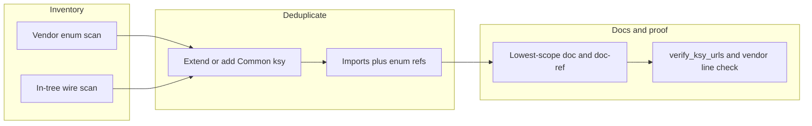

# Shared Kaitai enums, deduplication, and lowest-scope documentation

## What “lowest scope” means here

**Lowest scope** = put proof and prose at the **smallest place in the `.ksy` graph that still fully justifies the claim**, and cite the **narrowest stable anchor** in vendor/upstream code (or an in-tree line range that points at the canonical enum table).

Concretely:

- **Owning artifact**: Prefer **the `enums:` entry** (and **per-enum-member `doc:`** where Kaitai allows, as in [`formats/Common/bioware_gff_common.ksy`](formats/Common/bioware_gff_common.ksy)) over repeating the same URLs on every consumer. Thin files (e.g. GFF template capsules) should **point to Common + the wire spec**, not re-list xoreos/PyKotor trees.
- **Narrowest URL**: Prefer `blob/master/...#Lstart-Lend` (or a **specific symbol’s** line band) over repo roots, over generic wiki pages when a **function/struct/enum** in PyKotor or xoreos is the authority. Wiki links remain useful for **human narrative**; wire truth should still land on **symbol-level** refs where possible.
- **In-tree pointers**: For widely imported enums (e.g. [`formats/Common/bioware_type_ids.ksy`](formats/Common/bioware_type_ids.ksy)), use `doc-ref` entries like `formats/Common/....ksy#L…-L…` so consumers reference **one** table instead of pasting duplicate GitHub bands.
- **Field-level vs root**: Put **byte semantics** on the **`seq` field** (or the **enum member**) that corresponds to those bytes; keep **`meta.doc`** as a short orientation only (per [`AGENTS.md`](AGENTS.md) / [`scripts/audit_ksy_root_doc_lines.py`](scripts/audit_ksy_root_doc_lines.py) discipline).

This matches the existing house style: “wire documentation on the owning type/enum; consumers link to `formats/Common/`” ([`AGENTS.md`](AGENTS.md)).

## Current baseline (already aligned)

- **89** [`formats/**/*.ksy`](formats) files; **top-level `enums:`** today live almost entirely under [`formats/Common/`](formats/Common) (~19 files per grep), while format specs **import** and use `enum: module::name` (e.g. [`formats/GFF/GFF.ksy`](formats/GFF/GFF.ksy), [`formats/ERF/ERF.ksy`](formats/ERF/ERF.ksy)).
- Large shared tables already exist: [`bioware_type_ids.ksy`](formats/Common/bioware_type_ids.ksy), [`bioware_common.ksy`](formats/Common/bioware_common.ksy), [`bioware_gff_common.ksy`](formats/Common/bioware_gff_common.ksy), format-specific commons (`bioware_*_common.ksy`, `tga_common.ksy`).
- **GFF generics** (e.g. [`formats/GFF/Generics/UTC/UTC.ksy`](formats/GFF/Generics/UTC/UTC.ksy)) are intentionally **capsules** (delegate wire to [`GFF.ksy`](formats/GFF/GFF.ksy)); they should **not** grow duplicate enum blocks unless a template introduces **new** wire constants.

## Execution strategy (all `.ksy` files, without pointless churn)

Because “do every file” can mean either **mechanical review** or **new enums everywhere**, use a **two-track** pass so every file is touched meaningfully but Kaitai limits (e.g. **bitmasks** → no `enum:` on the raw field, per [`formats/MDL/MDL.ksy`](formats/MDL/MDL.ksy) comments) are respected.

### Track A — New or consolidated enums (vendor-driven)

1. **Initialize vendor trees** (for grep and for line-range proof): `git submodule update --init vendor/xoreos vendor/xoreos-tools vendor/xoreos-docs vendor/PyKotor vendor/reone` (and any others you rely on; see [`.gitmodules`](.gitmodules)). Note: **URLs in `.ksy` stay on canonical upstream `master`** per [`AGENTS.md`](AGENTS.md); submodules may be forks used only for **local** cross-checks.
2. **Harvest candidate enums** from vendor sources, prioritizing **wire-stable** integer sets:
   - xoreos: [`src/aurora/types.h`](https://github.com/xoreos/xoreos/blob/master/src/aurora/types.h), headers next to loaders (`gff3file`, `ncsfile`, texture paths, etc.).
   - xoreos-tools: readers/writers under `src/` (many already cited in `meta.xref`).
   - PyKotor: `IntEnum` / tables under `Libraries/PyKotor/src/pykotor/...` (resource types, GFF field types, language, etc.—some already mirrored).
   - Other vendors already referenced in specs (reone, KotOR.js, Kotor.NET): only add when the **same wire** appears in multiple specs or fills a gap.
3. **Merge duplicates**: If two Common files (or a Common + a top-level spec) encode the **same** mapping, **collapse** to one enum in the most appropriate `bioware_*_common.ksy` (or split a new `*_common.ksy` only when it avoids a circular import or keeps concerns clean—follow existing patterns).
4. **Attach enums to fields**: Add `enum: …` on fields where values are **discrete**; for **flags**, keep `value:`/`instance` patterns and document via `bioware_*::…_flag` value enums (MDL precedent).

### Track B — Per-file documentation pass (every `.ksy`)

For **each** of the 89 files:

- **Capsule / plaintext specs** (GFF generics, NSS, MDL_ASCII): ensure `doc`/`doc-ref` **defer** to the wire-owning spec + Common enums; **trim** repeated vendor link farms if they duplicate the same “reading list” already on the parent spec.
- **Wire specs**: ensure each **non-trivial `u1/u2/u4` field** that is a known closed set either has `enum:` → Common, or an explicit **`doc`** explaining why it stays raw (unknown extension, bitmask, variable semantics).
- **Link hygiene**: normalize to **canonical** GitHub URLs where the repo policy expects them ([`scripts/rewrite_canonical_github_urls.py`](scripts/rewrite_canonical_github_urls.py)); fix PyKotor wiki links per [`scripts/normalize_pykotor_wiki_urls.py`](scripts/normalize_pykotor_wiki_urls.py) and avoid known-bad slugs caught by [`scripts/verify_ksy_urls.py`](scripts/verify_ksy_urls.py).

## Verification (required before claiming “links are valid”)

From repo root, run the checks already documented in [`AGENTS.md`](AGENTS.md) (subset aligned to this task):

- `python scripts/verify_ksy_urls.py --check-xoreos-github-line-ranges --check-openkotor-wiki-titles --also docs/XOREOS_FORMAT_COVERAGE.md`
- `python scripts/audit_bioware_type_ids_docrefs.py` (if `bioware_type_ids.ksy` enum rows / `doc-ref` bands move)
- `python scripts/check_vendor_xoreos_xref_lines.py --also docs/XOREOS_FORMAT_COVERAGE.md` (needs populated `vendor/xoreos*`)
- `python scripts/audit_ksy_root_doc_lines.py --strict`
- Recompile / tests as your branch already does (e.g. [`scripts/compile_all_ksy.py`](scripts/compile_all_ksy.py), `pytest`) so imports and enum references stay valid.

**PDF / non-text upstreams** (xoreos-docs `*.pdf`): valid links are typically **file-level**; don’t invent `#L` anchors—use page/section references in prose or cite an HTML spec when a line anchor exists.

## Deliverables

- Updated [`formats/Common/*.ksy`](formats/Common) with **new or merged** enums where vendor/commonality demands it.
- Updated format `.ksy` files to **import** and use `enum:` references instead of duplicating tables.
- **Lowest-scope** documentation: concentrated `doc-ref` + per-member `doc` on owning enums; thinner `meta.doc` on consumers.
- Evidence: clean output from the verification commands above.

## Risks / explicit non-goals

- **Kaitai enum limitations**: duplicate integer keys, bitmasks, and “open-ended” extension values may require **not** using `enum:` on the wire field; document instead.
- **Scope creep**: plaintext grammars (NSS, MDL_ASCII) are poor candidates for binary-style enums; keep references to binary companions.
- **Submodule drift vs `master` URLs**: if upstream moves lines, update `#L` bands and re-run `verify_ksy_urls.py --check-xoreos-github-line-ranges` (policy is already spelled out in [`AGENTS.md`](AGENTS.md)).
