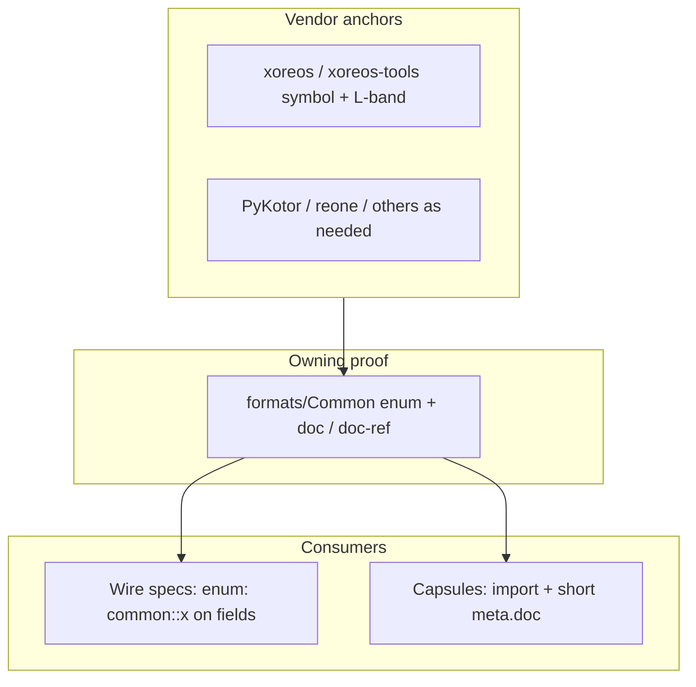

# Shared enums, deduplication, and lowest-scope vendor links (all `formats/**/*.ksy`)

## What you mean by **“lowest scope”** (definition)

**Lowest scope** means: place **proof and explanation at the smallest node in the `.ksy` graph that still fully justifies the wire claim**, and cite the **narrowest stable anchor** in upstream or in-tree code.

Concretely (aligned with [AGENTS.md](AGENTS.md) and the prior write-up in [`.cursor/plans/ksy_enums_and_docs_809ea5fa.plan.md`](.cursor/plans/ksy_enums_and_docs_809ea5fa.plan.md)):

- **Owning type vs consumer**: If the same integer map appears in more than one format, the **enum table lives once** in an appropriate [`formats/Common/bioware_*_common.ksy`](formats/Common) or [`formats/Common/bioware_type_ids.ksy`](formats/Common/bioware_type_ids.ksy). **Per-member `doc:`** (where useful) and **`doc-ref`** bands sit on that **owning** enum, not on every importing spec.
- **Narrowest URL**: Prefer **`blob/.../file.ext#Lstart-Lend`** (or a **symbol-level** line band in xoreos / PyKotor / xoreos-tools) over repository roots, directory-only `tree/`, or long “reading lists” repeated in multiple files. Wiki links are fine for **human narrative**; **wire truth** should still have a **code anchor** when one exists.
- **In-tree pointers**: For widely shared tables, add **`doc-ref`** like `formats/Common/....ksy#Lx-Ly` so many consumers can point at **one** row range instead of pasting duplicate GitHub bands.
- **Field vs root `meta.doc`**: Put **byte semantics** on the **`seq` field** (or **enum member**) that owns those bytes. Keep root [`meta.doc:`](formats/GFF/GFF.ksy) **short orienteering**; enforce line-count discipline via [`scripts/audit_ksy_root_doc_lines.py --strict`](scripts/audit_ksy_root_doc_lines.py) (as in AGENTS).
- **Capsule specs** (e.g. [GFF generics like `UTC.ksy`](formats/GFF/Generics/UTC/UTC.ksy)): **delegate** to the wire-owning spec ([`GFF.ksy`](formats/GFF/GFF.ksy) + Common enums); do **not** grow duplicate `enums:` blocks unless the capsule introduces **new** wire constants.

**Policy note (canonical upstream):** `meta.xref` / `doc-ref` URLs should use **canonical `master`** on the upstream orgs named in AGENTS (xoreos, xoreos-tools, OpenKotOR/PyKotor, etc.), even if local [`vendor/`](.gitmodules) submodules are forks or pinned SHAs—line drift is handled by [`scripts/verify_ksy_urls.py`](scripts/verify_ksy_urls.py) and [`scripts/check_vendor_xoreos_xref_lines.py`](scripts/check_vendor_xoreos_xref_lines.py).

## Baseline in this repo (so the plan is honest)

- There are **89** [`formats/**/*.ksy`](formats) files. Root-level `enums:` currently appear in **19** files under [`formats/Common/`](formats/Common) (grep: `^enums:`), while format modules **import** and use `enum: some_common::name` (e.g. [`GFF.ksy`](formats/GFF/GFF.ksy) uses `bioware_gff_common::gff_aurora_container_magic_be`).
- A previous internal plan file marks related todos complete; this pass should still **re-verify** (submodules, URLs, compiles) because **upstream `master` line ranges and wiki slugs drift**.

## Execution strategy (every `.ksy`, without churn)

**A. Inventory (find remaining duplication / gaps)**

1. Initialize **vendor trees** used for line-range cross-checks: `git submodule update --init` for `vendor/xoreos`, `vendor/xoreos-tools`, `vendor/xoreos-docs`, `vendor/PyKotor`, and any other submodules you cite heavily (see [`.gitmodules`](.gitmodules); optional: `vendor/reone`, `vendor/KotOR.js`, `vendor/Kotor.NET` for harvest-only greps).
2. **Vendor harvest**: search for **wire-stable** `enum` / `const` / `IntEnum` / `k*` tables in:
   - `vendor/xoreos/src/aurora/*.h` and adjacent loaders (notably [`types.h`](https://github.com/xoreos/xoreos/blob/master/src/aurora/types.h)-style files),
   - `vendor/xoreos-tools/src/**` readers/writers,
   - `vendor/PyKotor/Libraries/PyKotor/src/pykotor/**` (resource type IDs, GFF field types, language, etc.).
3. **In-tree harvest**: for each of the **89** files, identify `seq` fields that are **closed small sets** but still raw integers (no `enum:`). Prioritize fields already described in prose as a fixed set. **Do not** force `enum:` where the wire is a **bitmask**, **extensible**, or **duplicate integer keys** (Kaitai limitations—document with `doc` / `valid` / instances instead; precedent in [`MDL.ksy`](formats/MDL/MDL.ksy) comments).

**B. Consolidate into Common**

- **Merge** duplicate maps: if two specs encode the same mapping, keep **one** enum in the most natural owner (`bioware_type_ids.ksy` for Aurora `FileType` / restype space; `bioware_gff_common.ksy` for GFF wire tags; format-specific `bioware_*_common.ksy` for domain constants like BIF/ERF/MDL, following existing files such as [`bioware_bif_common.ksy`](formats/Common/bioware_bif_common.ksy)).
- **Imports**: follow existing pattern—`meta.imports` last segment **`lower_snake_case`** per AGENTS; reference enums as `module::enum_name` on fields.
- **GFF generics**: keep them as **capsules** (pattern in [`UTC.ksy`](formats/GFF/Generics/UTC/UTC.ksy))—link to `GFF.ksy` + `bioware_type_ids` + `doc-ref` excerpts only.

**C. Documentation + link hygiene (lowest scope)**

- For each new or moved enum: add **`doc` / `doc-ref`** on the **enum** (and per-value `doc` where it helps), then **remove** duplicate upstream link farms from consumers if they only repeat the same proof.
- Run [`scripts/rewrite_canonical_github_urls.py`](scripts/rewrite_canonical_github_urls.py) if fork/pin URLs crept in; run [`scripts/normalize_pykotor_wiki_urls.py`](scripts/normalize_pykotor_wiki_urls.py) for wiki hub slugs (see always-on rules in [`verify_ksy_urls.py`](scripts/verify_ksy_urls.py) docstring: reject standalone `*-File-Format` wiki slugs that resolve to *Home*).
- **PDFs** in `xoreos-docs`: valid links are often **file-level**; do not invent `#L` anchors—use page/section in prose or cite HTML when line anchors exist (as noted in the prior plan).

**D. Verification (required before claiming “links are valid”)**

From repo root, run the **same battery as** [AGENTS.md](AGENTS.md) (adjust if CI adds flags):

- `python scripts/verify_ksy_urls.py --check-xoreos-github-line-ranges --check-openkotor-wiki-titles --also docs/XOREOS_FORMAT_COVERAGE.md`
- `python scripts/audit_bioware_type_ids_docrefs.py` (if `bioware_type_ids.ksy` enum rows / `doc-ref` bands move)
- `python scripts/check_vendor_xoreos_xref_lines.py --also docs/XOREOS_FORMAT_COVERAGE.md` (needs populated `vendor/xoreos*`)
- `python scripts/audit_ksy_root_doc_lines.py --strict`
- `python scripts/compile_all_ksy.py` (or the project’s standard KSC pass) + `python -m pytest -q` so imports and generated expectations stay consistent.

## Deliverables

- Extended or merged enums under [`formats/Common/*.ksy`](formats/Common) where **objective commonality** across vendor trees and multiple formats exists.
- Updated wire specs with `enum:` references; **thinner** `meta.doc` / `meta.xref` on consumers where duplication is removed.
- Clean output from the verification commands above; **no invalid** `meta.xref` folding footguns (`some_key: >` + `note:`) — `verify_ksy_urls.py` guards this.

## Explicit non-goals (avoid scope creep)

- **Plaintext/XML grammars** (e.g. [`NSS.ksy`](formats/NSS/NSS.ksy), [`MDL_ASCII.ksy`](formats/MDL/MDL_ASCII.ksy), [`ITP_XML.ksy`](formats/ITP/ITP_XML.ksy)) are not good candidates for binary-style wire enums; keep references to binary companions and narrative docs only.
- **Engine-game content enums** (hundreds of plot/ability IDs) unless they are **true file-wide wire constants**—prefer leaving raw or `valid` ranges with a single upstream pointer.
