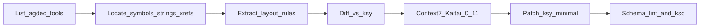

# RE-driven alignment of KotOR `.ksy` with `swkotor.exe` (via agdec-http)

## Context and constraints

- Your Cursor MCP defines server id **`agdec-http`** (HTTP MCP + Ghidra server headers for repository **`Odyssey`**). Execution phase should **list that server’s tools first** (Cursor MCP tool descriptors / `tools/list`), then call only documented tools with the binary path you gave: **`/K1/k1_win_gog_swkotor.exe`** (confirm this path matches the Odyssey project layout; adjust if the server returns “not found”).
- **Goal you chose:** apply the workflow **across KotOR-relevant formats**, not only GFF. Treat **[formats/GFF/GFF.ksy](formats/GFF/GFF.ksy)** as the **template** for how to document deltas (header layout, type enums, offset bases, edge cases), then repeat in waves for other `.ksy` files that plausibly correspond to code in K1.
- **Reality check:** the executable contains **loader/parser implementations**, not the `.gff` files themselves. RE validates **what the game does** (which may differ slightly from wiki-derived specs). Still cross-check ambiguous cases against **[vendor/PyKotor/wiki/](vendor/PyKotor/wiki/)** when the binary is obfuscated or has multiple code paths.
- **Kaitai docs:** use **Context7** (`resolve-library-id` → `query-docs`) for **Kaitai Struct** / compiler **0.11** behavior when deciding *how* to express fixes in `.ksy` (e.g. `instances` vs `types`, `valid` syntax, imports, `if`/`pos` patterns). Your root **[.cursorrules](.cursorrules)** already encodes repo-specific rules (enum/`valid` shapes, lowercase imports, post-change schema lint against **[include/ksy_schema.json](include/ksy_schema.json)**).

## What “good” looks like for each format

For each target `.ksy`, produce a short **evidence table** before editing:

| Topic | From RE (agdec-http) | From `.ksy` today | Decision |
|------|----------------------|-------------------|----------|
| Magic / version strings | xrefs + decompile snippets | `meta` + header `seq` | match or document intentional subset |
| Record sizes | struct/array stride in code | `repeat-expr` / `size` | fix if provably wrong |
| Offsets | absolute vs relative base | `_root.header.*_offset + …` | align to engine |
| Enums | switch/cmp chains | `enums:` | reorder/add values with `TODO: VERIFY` if ambiguous |
| Unsupported paths | dead code / Xbox branch | N/A | comment or `TODO:` in `.ksy` |

## Execution workflow (repeat per format family)

1. **Discover MCP capabilities**  
   Enumerate `agdec-http` tools (names + JSON schemas). Map them to tasks: symbol search, string search, xrefs, decompile, disassemble, read memory, program metadata, etc. (Exact names depend on the server.)

2. **Seed searches in the binary** (high signal, low noise)  
   - **GFF:** strings like `GFF `, `V3.2`, common FourCCs; xrefs to functions that parse headers of **56 bytes** / tables described in [formats/GFF/GFF.ksy](formats/GFF/GFF.ksy) (`gff_header`, `struct_entry`, `field_entry`, list layouts).  
   - **Chitin family:** `chitin.key`, `data\\`, `BIF`, `KEY`, `RIM`, `ERF` / `MOD` patterns per [formats/BIF/KEY.ksy](formats/BIF/KEY.ksy), [formats/BIF/BIF.ksy](formats/BIF/BIF.ksy), [formats/RIM/RIM.ksy](formats/RIM/RIM.ksy), [formats/ERF/ERF.ksy](formats/ERF/ERF.ksy).  
   - **TLK / 2DA / SSF / LIP / VIS / LYT / MDL / TPC / WAV / NSS/NCS:** search distinctive magics / filenames / log strings; follow xrefs to parsers.

3. **Extract “absolute” rules from decompilation**  
   Prefer **one canonical parse path** (the one used at runtime for PC GOG build). Record: struct field order, endianness, bounds checks, and **offset interpretation** (file-absolute vs section-relative vs relative to `field_data_offset` as already modeled in `field_entry` instances in GFF).

4. **Diff against `.ksy`**  
   For GFF, walk the type tree in [formats/GFF/GFF.ksy](formats/GFF/GFF.ksy) (header + arrays + `resolved_struct` helpers) and mark each mismatch with file/line + RE citation (function name + address + short pseudocode summary).

5. **Translate fixes into idiomatic Kaitai 0.11**  
   Use Context7 answers to choose the smallest expressive change (avoid rewriting large `types:` blocks unless RE proves a structural error).

6. **Repo hygiene (mandatory per [.cursorrules](.cursorrules))**  
   - After each `.ksy` edit: validate against **[include/ksy_schema.json](include/ksy_schema.json)**.  
   - Regenerate via **[scripts/generate_code.ps1](scripts/generate_code.ps1)** (and **[scripts/generate_code.sh](scripts/generate_code.sh)** if touched).  
   - **Commit each changed file individually** with Conventional Commits (`fix(gff): …`, `fix(bif): …`), never `git add .`.

## Rollout order (KotOR-first, systematic)

To keep “all KotOR `.ksy`” tractable, process in **waves** (each wave ends with a small commit series):

- **Wave A — Foundations:** [formats/Common/BioWare_Common.ksy](formats/Common/BioWare_Common.ksy), [formats/Common/BioWare_TypeIds.ksy](formats/Common/BioWare_TypeIds.ksy), [formats/Common/BioWare_Extraction.ksy](formats/Common/BioWare_Extraction.ksy) (only if RE shows shared constants/layouts used by multiple parsers).
- **Wave B — GFF core + derivatives:** [formats/GFF/GFF.ksy](formats/GFF/GFF.ksy) then [formats/GFF/XML/GFF_XML.ksy](formats/GFF/XML/GFF_XML.ksy) / [formats/GFF/JSON/GFF_JSON.ksy](formats/GFF/JSON/GFF_JSON.ksy) (XML/JSON should track binary semantics; do not “fix” from `.exe` unless the RE target is actually those serializers).
- **Wave C — Container/index formats:** [formats/BIF/KEY.ksy](formats/BIF/KEY.ksy), [formats/BIF/BIF.ksy](formats/BIF/BIF.ksy), [formats/BIF/BZF.ksy](formats/BIF/BZF.ksy), [formats/RIM/RIM.ksy](formats/RIM/RIM.ksy), [formats/ERF/ERF.ksy](formats/ERF/ERF.ksy).
- **Wave D — Table/text/audio/visual:** [formats/TLK/TLK.ksy](formats/TLK/TLK.ksy), [formats/TwoDA/TwoDA.ksy](formats/TwoDA/TwoDA.ksy), [formats/SSF/SSF.ksy](formats/SSF/SSF.ksy), [formats/LIP/LIP.ksy](formats/LIP/LIP.ksy), [formats/VIS/VIS.ksy](formats/VIS/VIS.ksy), [formats/LYT/LYT.ksy](formats/LYT/LYT.ksy), [formats/LTR/LTR.ksy](formats/LTR/LTR.ksy), [formats/WAV/WAV.ksy](formats/WAV/WAV.ksy), [formats/TPC/TPC.ksy](formats/TPC/TPC.ksy) (+ texture helpers as referenced).
- **Wave E — Models/scripts:** [formats/MDL/MDL.ksy](formats/MDL/MDL.ksy), [formats/MDL/MDX.ksy](formats/MDL/MDX.ksy), [formats/NSS/NCS.ksy](formats/NSS/NCS.ksy) / [formats/NSS/NCS_minimal.ksy](formats/NSS/NCS_minimal.ksy), [formats/NSS/NSS.ksy](formats/NSS/NSS.ksy).
- **Wave F — Deprioritize non-K1 engines unless proven in-binary:** [formats/DAS/DAS.ksy](formats/DAS/DAS.ksy), [formats/DA2S/DA2S.ksy](formats/DA2S/DA2S.ksy), [formats/PCC/PCC.ksy](formats/PCC/PCC.ksy) — skip unless `agdec-http` searches show they are actually linked/used.

## Risk controls

- **Multiple parsers / legacy paths:** prefer the path exercised for **PC retail/GOG**; document others with `TODO: SIMPLIFIED` or `doc:` notes.  
- **Compiler reordering / inlined parsing:** if a layout cannot be proven, do not “fix” the `.ksy`; add `TODO: VERIFY` and keep wiki cross-reference.  
- **Secrets:** treat MCP headers/credentials as sensitive; do not commit them into the repo.

## Deliverables

- A short **RE evidence appendix** (markdown under `docs/` **only if you explicitly want it**; otherwise keep evidence in PR/commit messages / issue notes to avoid doc sprawl).  
- **Targeted `.ksy` patches** with schema-valid Kaitai expressions, regenerated outputs, and conventional commits per file.
